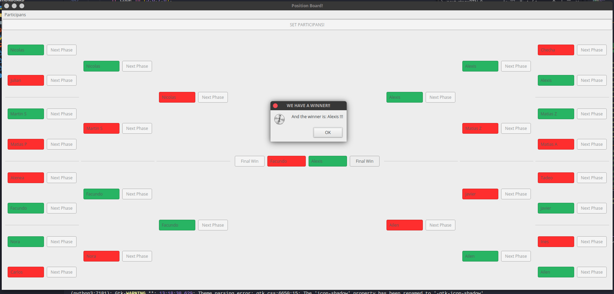

# PositionBoard

This software is for the tournament of Ping Pong in Holberton School (you can use it in another tournament where 16 participans are in)

## Files
|   **Content of this repo**    |
|---------------|
| Data - Folder that contains the code of a simple database |
| GUI - Folder that contains the source python code for GUI functionality. This code is getting from pyuic5 |
| img - Folder that contain a sample image of the software |
| gui_main.py - Main code of the software |
| participant_raw.ui - Interfaz without pyuic5 |
| raw.ui - Main GUI |

